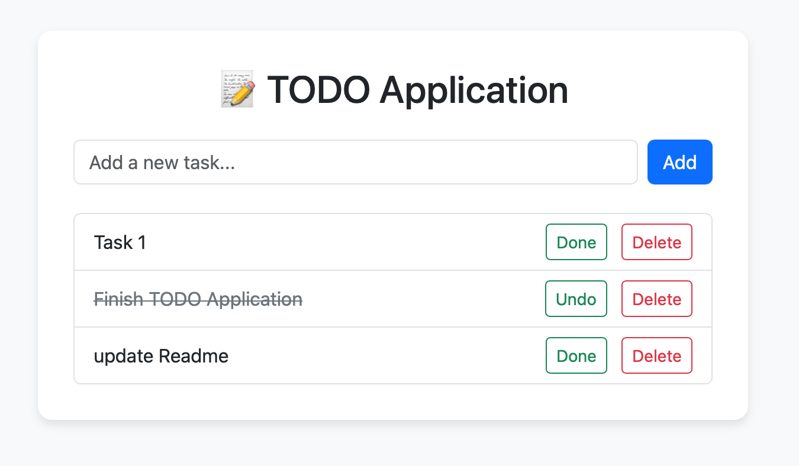

#  ToDo App (Spring Boot + Thymeleaf)

A simple, responsive ToDo list web application built using **Spring Boot**, **Thymeleaf**, and **Bootstrap 5**.

## Features

- Add new tasks
- Mark tasks as Done and undo the action
- Delete tasks
- UI built with Bootstrap
- Server-side rendered using Thymeleaf

##  ScreenShot



## Tech Stack used

- Java 24
- Spring Boot
- Spring MVC
- Thymeleaf
- Bootstrap 5
- MySQL
- Maven

## Run it Locally

```bash
git clone https://github.com/SONISOMYA/todo_app.git
cd todo_app
./mvnw spring-boot:run
